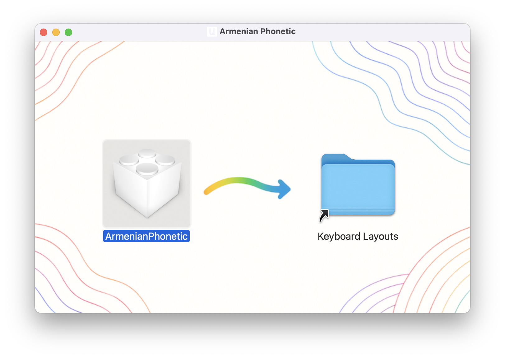
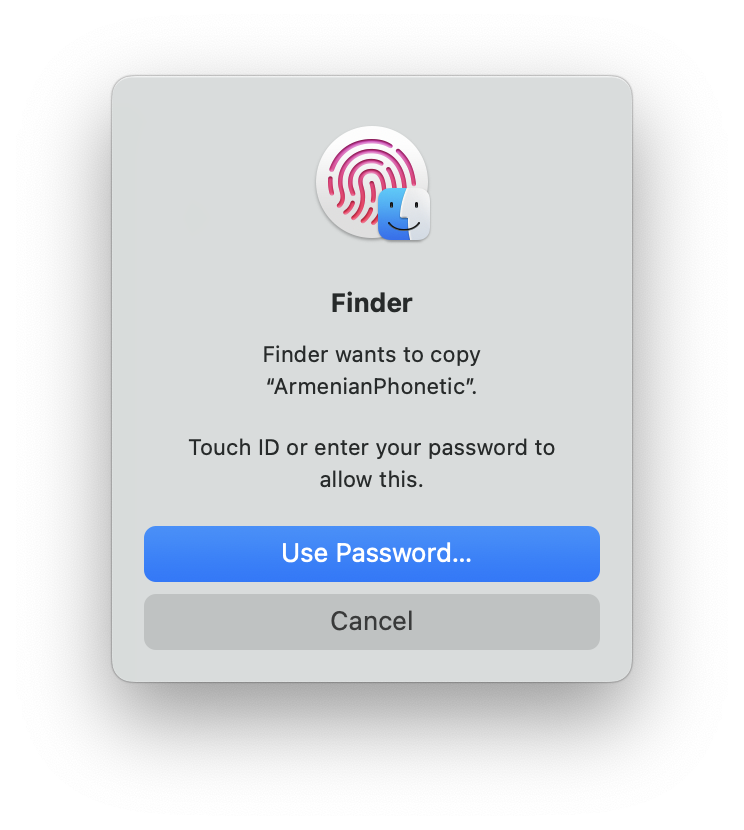
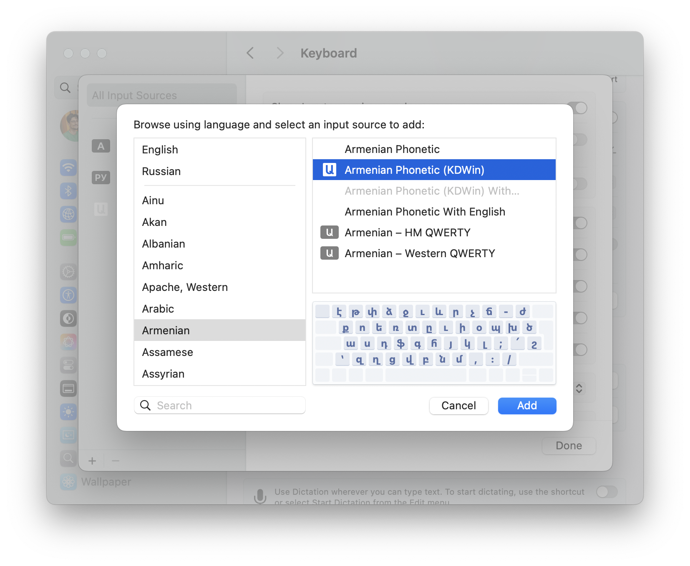
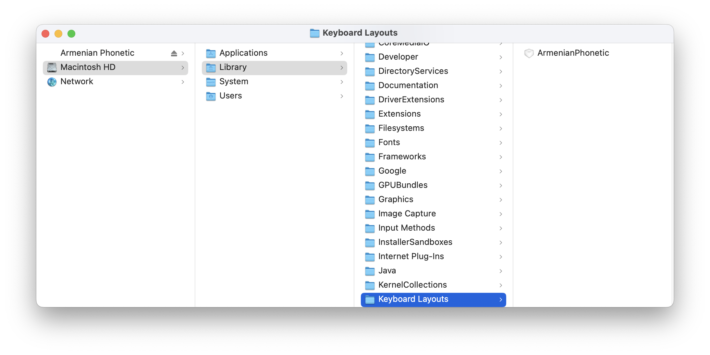
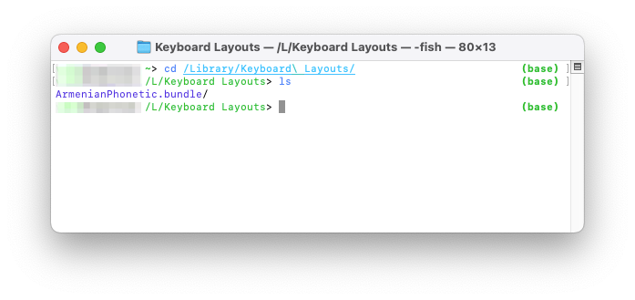

## [Armenian Phonetic Keyboard Layout](http://evoyan.org/armenian-phonetic-for-mac)

### Armenian phonetic keyboard layout for Mac OSX.

This project was initiated as an alternative keyboard layout for those who have an experience of working with Armenian Phonetic layout in Windows/Linux. It basically is created from scratch using [Ukelele](http://scripts.sil.org/cms/scripts/page.php?site_id=nrsi&id=ukelele) tool on Mac for editing keyboard layouts. It is hosted on [Github](https://github.com/vahe-evoyan/armenian-phonetic) page. Please feel free to file bugs right on [Github](https://github.com/vahe-evoyan/armenian-phonetic/issues). I'll do my best to address them as quickly as possible.

Below are brief instructions on the layout set-up.

#### Included Layouts

* Armenian Phonetic - Regular phonetic layout where key "R" types "ր".
* Armenian Phonetic (KDWin) - Exactly the same layout as in KDWin.
* Armenian Phonetic With English - Option key changes the keys to English in place of special characters.
* Armenian Phonetic (KDWin) With English - KDWin phonetic layout with Option key feature.

#### How To Install
1. Download [ArmenianPhonetic.dmg](https://github.com/vahe-evoyan/armenian-phonetic/releases/download/v2.2.0/ArmenianPhonetic.dmg) file from the releases section.

2. Drag the `ArmenianPhonetic` file to the `Keyboard Layouts` folder.
3. The system will ask you to authenticate, as the directory requires super user access.

4. The layouts should appear in the *Language & Text* (or System Preferences > Keyboard > Input Sources) preferences section. *In case they didn't, simply log out and log back in, so that the OS reloads the layouts.*



### Manual Installation

**This method is compatible with Macs running on Apple Silicon (tested on Apple M1 and M3 Pro).**

---

#### 1. Download and Move the Layout Files

- Download the [ArmenianPhonetic.bundle](./ArmenianPhonetic.bundle) folder or the DMG file from the releases page. The DMG file contains the `ArmenianPhonetic.bundle`. Note that in the macOS UI, the `.bundle` appears as a single file but is actually a folder.
- Copy the `ArmenianPhonetic.bundle` to the `~/Library/Keyboard Layouts/` directory (or `/Library/Keyboard Layouts/` to install system wide).
  To access the Library folder:
  1. Open Finder and navigate to your home folder (`Command-Shift-H`).
  2. In the menu, go to `View > Show View Options` (`Command-J`) and check the "Show Library Folder" option. Refer to the screenshot below for guidance:
     

Alternatively, if you are comfortable with terminal and git commands, you can execute the following to automate the process:

```sh
git clone https://github.com/vahe-evoyan/armenian-phonetic.git \
    && cp -r ./armenian-phonetic/ArmenianPhonetic.bundle \
    ~/Library/Keyboard\ Layouts/ && rm -rf ./armenian-phonetic/
```

Once completed, verify the `~/Library/Keyboard Layouts/` directory to confirm the layout files have been correctly copied. You can check using Finder or the terminal:

- Finder View:
  
- Terminal View:
  

---

#### 2. Load the Layout

To apply the changes, log out of your macOS account and log back in. A full system restart is recommended for best results.

---

#### 3. Activate the Layout

- **For older macOS versions:**
  Navigate to *System Preferences > Keyboard > Input Sources* (or *Language & Text* in older versions). Locate and enable the *Armenian - Phonetic* checkbox.

- **For newer macOS versions:**
  Open *System Settings* and search for "Keyboard layouts" (or go to *System Settings > Keyboard > Input Sources*).
  1. Click the "+" button in the bottom-left corner.
  2. Select "Armenian" from the list of languages.
  3. Choose your preferred *Armenian Phonetic* layout from the options on the right and click "Add."
